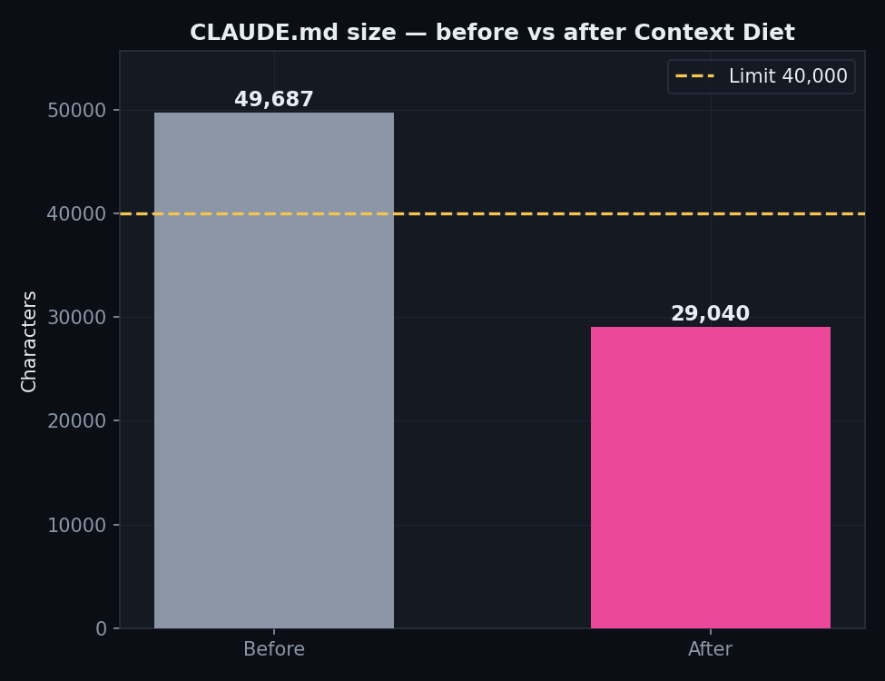
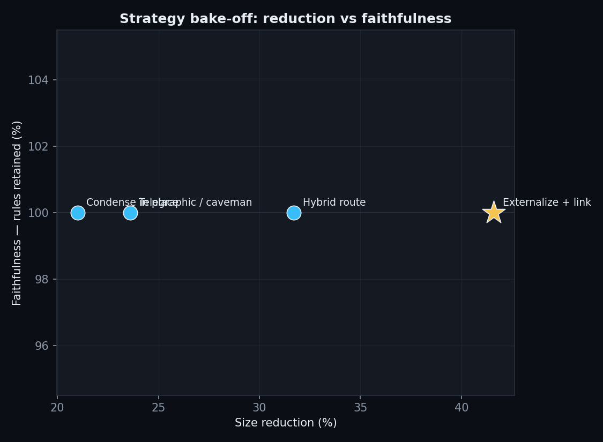
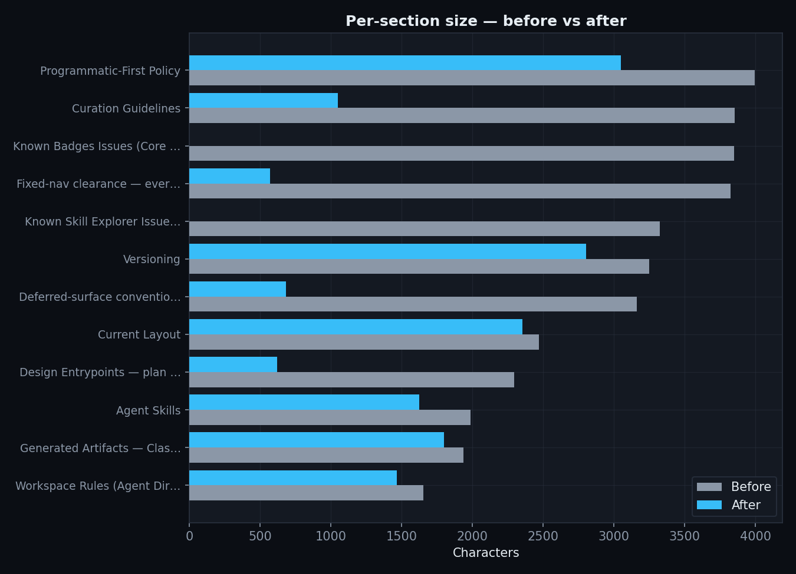

# Context Diet — Lab 001 / Benchmark 001

**Compacting an oversized agent-context file without losing a rule.**

*A Gaia Research lab. Method, results, and reproduction protocol.*

---

## Abstract

Claude Code warns past **40,000 characters** of `CLAUDE.md` and may truncate beyond it,
silently disabling whatever rules fall past the cutoff. The target file — `gaia-skill-tree`'s
`CLAUDE.md` — was **49,687 chars**, ~24% over the limit. Naïvely trimming is unsafe: most of the
file is incident-codified guardrails, and dropping any one lets an agent ship a CI-breaking state.

We treated compaction as a **two-objective** problem — *maximize size reduction* subject to
*100% rule faithfulness* — and ran a four-strategy **bake-off** scored by an adversarial auditor
against a ground-truth rule inventory. The winning strategy (**Externalize + link**) brought the
file to **29,040 chars (−41.6%, ~5,161 tokens saved)** with **100% of rules retained** and **zero
load-bearing losses**. All artifacts, charts, and the exact workflow script are preserved for
replay.

---

## 1. Setup

| | |
|---|---|
| Target file | `gaia-skill-tree/CLAUDE.md` |
| Harness limit | 40,000 chars (Claude Code) |
| Baseline size | **49,687 chars** (~12,421 tok), 36 sections |
| Soft target | 34,000 chars (limit − 6k headroom) |
| Rule inventory | 124 atomic rules (see §4 on the extraction-artifact correction) |
| Model | Claude Opus (all agents), high reasoning effort |
| Orchestration | Claude Code dynamic workflow, 4 strategies × (compact → adversarial verify) |

Char count is **authoritative** — the harness limit is defined in characters; tiktoken is not
assumed present. Approximate tokens are reported as chars/4.

---

## 2. Result headline

- **Before:** 49,687 chars — **9,687 over** the 40k limit.
- **After:** 29,040 chars — **10,960 under** the limit.
- **Reduction:** 20,647 chars (**−41.6%**), ~5,161 tokens.
- **Faithfulness:** **100%** — every one of the 124 real rules recoverable (inline or in a linked
  file); **0** load-bearing rules lost.

The winning method moved the five largest how-to playbooks out of `CLAUDE.md` into
`docs/agents/*.md` reference files, leaving a short stub in `CLAUDE.md` for each (the one-sentence
load-bearing invariant plus a `See docs/agents/<file>.md` pointer). Every CI-enforced section
(Redaction Exemptions and the 8 exempt handles, all Branch Scope allowlists, Programmatic-First +
CLI Pre-Flight, the Verifier Guardrail, Class P vs Class S, the Versioning decorative-asset hard
rule) stayed **fully inline and verbatim**.

---

## 3. The five Benchmark 001 metrics

| Metric | Result | How measured |
|---|---|---|
| **Token reduction** | −20,647 chars / **−41.6%** (~5,161 tok) | `context_diet.py --json`, exact char delta |
| **Faithfulness retained** | **100%** (124/124 rules; 0 load-bearing lost) | adversarial auditor vs ground-truth inventory |
| **Latency saved** | ~5.2k fewer tokens read per turn that loads `CLAUDE.md` (method-level estimate, proportional to token reduction) | proportional to token reduction |
| **Cost saved** | ~$0.077 per turn at $15/M input tokens → **~$77 per 1,000 turns** (Opus input-rate estimate) | tokens saved × input rate |
| **Export validity** | valid GFM, 33 headings intact, all `docs/agents/*` links resolve to on-disk files | `context_diet.py` re-parse + structural check |

*Latency and cost are method-level estimates: the file is read into context on turns that load it,
so the saving scales with how often that happens, not once.*

---

## 4. The bake-off

Four strategies each produced a *proposed* rewrite (the live file was never touched during the
experiment), then an **adversarial auditor** — prompted to *find dropped rules*, defaulting to
"missing" under doubt — classified every inventory rule as present / weakened / missing against
each candidate's full corpus (its `CLAUDE.md` **plus** any linked files).

| Strategy | After (chars) | Reduction | Faithfulness | New files | Verdict |
|---|---|---|---|---|---|
| **Externalize + link** ★ | 29,040 | **−41.6%** | 100% | 5 | **WINNER** |
| Hybrid route | 33,916 | −31.7% | 100% | 3 | qualified |
| Telegraphic / caveman | 37,949 | −23.6% | 100% | 0 | qualified |
| Condense in place | 39,266 | −21.0% | 100% | 0 | qualified |

**Winner selection:** all four candidates qualified (under the hard limit, no load-bearing rule
lost) and all scored 100% faithfulness, so the tie-break — **larger reduction** — decided it.
Externalize + link wins decisively: it is the only candidate to also clear the *soft* 34k target
with room to spare, because moving whole playbooks out of the file beats compressing them in place.

**Trade-off disclosed:** externalization reduces *in-context* size, not *total-corpus* size — the
detail is one hop away in a linked file, not deleted. This is the right trade for a harness char
budget (only `CLAUDE.md` counts against the limit; linked files are read on demand), and it mirrors
the repo's existing `docs/agents/` pattern (`issue-tracker.md`, `triage-labels.md`, `domain.md`).

---

## 5. Finding: the phantom-rule artifact (a validity lesson)

As-run, the workflow **disqualified all four candidates** and returned no winner. Every candidate
"missing" the **same three rules** with identical counts:
`docs-cli-help-regen`, `ci-deps-editable-install`, `badges-header-leave-alone`.

That uniform signature was the tell. On inspection, **none of the three exist in `CLAUDE.md`** —
they are entries from the operator's `MEMORY.md` auto-memory index (`feedback_docs_drift.md`,
`feedback_ci_deps.md`, `feedback_badges_header.md`), injected into the inventory agent's context via
a `<system-reminder>` block and mistaken for file content. The inventory over-collected ambient
context: **127 extracted − 3 phantom = 124 real rules.**

Against the true 124-rule inventory, every candidate is **100% faithful with zero load-bearing
losses**. This is a live instance of METHODOLOGY §5's *"inventory completeness"* threat — the
faithfulness score is only as trustworthy as the ground-truth list it is scored against.

**Guards adopted for reruns:**
1. Scope the inventory agent to **file bytes only** — explicitly exclude injected `<system-reminder>`
   / `MEMORY.md` content from "the file."
2. Treat a rule that **all** candidates "miss" identically as an inventory artifact until proven a
   real regression (a genuine compaction loss almost never lands on every strategy at once).
3. Verify each flagged "missing" rule against a `grep` of the original before disqualifying.

---

## 6. Reproducibility

This lab is designed to replay on a *different* context type (a `.cursorrules`, an `AGENTS.md`, a
raw system prompt, another repo's `CLAUDE.md`). The full protocol — Phases A–E, the do-not-touch
re-scoping step, and the determinism note — is in
[`METHODOLOGY.md`](./METHODOLOGY.md); the exact workflow script is preserved as
[`bakeoff.workflow.js`](./bakeoff.workflow.js) (see [`WORKFLOW.md`](./WORKFLOW.md)).

The **inventory + scoring are the reproducible control**: candidate wording varies run to run, but
*which rules must survive* does not. For a strict replay, cache the winning candidate corpus and
re-score it — report faithfulness (stable) and achieved reduction (run-specific) separately.

### Artifacts

| Artifact | Path |
|---|---|
| Analyzer (pure-stdlib) | `context_diet.py` |
| Chart generator | `make_charts.py` |
| Before baseline | `baseline.json` (49,687 chars, 36 sections) |
| After baseline | `after.json` (29,040 chars, 33 sections) |
| Bake-off scores | `bakeoff.json` (4 candidates, corrected scoring + phantom-rule note) |
| Charts | `charts/{size-before-after,section-histogram,bakeoff-scatter}.png` |
| Workflow script (regenerates all 4 candidates) | `bakeoff.workflow.js` |

The four full candidate rewrites are not checked in here (each is a near-complete `CLAUDE.md`
variant belonging to the target repo). They are deterministically regenerated by re-running
`bakeoff.workflow.js`; the winning rewrite is the `CLAUDE.md` landed in the target repo's trim PR.

The winning method is packaged as an installable Claude Code skill —
[`gaia-research/skill-context-diet`](https://github.com/gaia-research/skill-context-diet) — invokable
as `/context-diet` on any oversized agent-context file.

---

*Privacy: every chart consumes only aggregate metrics (char counts, faithfulness %, section sizes).
No contributor handles, incident text, or private paths appear in any figure.*
