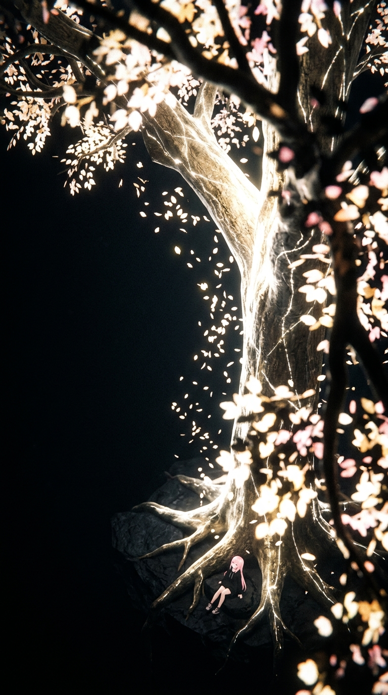

# Commission Brief — Milim "Take Root" Illustration

**Status:** Active. Replaces the vector SVG circuit-tree asset in the "Let the research take root" section (`<RegistryHandoff />`).

## Purpose

To visually reinforce the transition from open research to the Gaia Skill Tree by replacing the abstract circuit-tree SVG with an atmospheric, character-driven illustration of Milim Nova resting at the base of a massive golden tree. This grounds the "Take Root" metaphor in our world and character, offering a moment of quiet, cinematic beauty before handing off to the registry.

## Target Surface & Assembly

*   **Component:** `components/RegistryHandoff.tsx`
*   **Placement:** On the right side, replacing the `<figure className="registry-tree">` SVG.
*   **Behavior:** The image will be treated as a responsive `<picture>` or `next/image` element, blending into the obsidian background.
*   **Quality Assurance:** After integration, we will use the `impeccable` skill to ensure the layout remains balanced and typography breathes. The `visual-audit` skill must be run to guarantee no horizontal cut-off occurs on mobile breakpoints.

## Source of Truth (Character Lock)

Refer to `../marketing-tasks/MILIM.md` for strict character adherence. 

*   **Age/Proportions:** Youthful chibi proportions (8-10 years old).
*   **Hair:** Very long, flowing bright pink hair, completely unbound (no twintails). Neat, choppy bangs with exactly **two small yellow star hairpins** on the left.
*   **Face:** Closed eyes, looking peaceful/sleeping.
*   **Outfit:** Oversized pitch-black hoodie with "DRAGONOID No. 1" and the white baby dragon print. Black thigh-high socks with two neon pink stripes, chunky black/white/pink sneakers.
*   **Rule:** No third-party anime/IP likeness.

## Mockup Reference

*(Note: A highly directional mockup emphasizing the extreme scale, right-side weighting, and celestial ley line styling. Milim is nestled tiny at the bottom roots.)*

### Mockup Prompt
*The following prompt was used to generate the reference mockup and should be used as the starting point for production generation:*

> "A dizzying, extreme high-altitude bird's eye view looking steeply down through the branches of a single massive tree. The camera is high up in the top canopy, looking diagonally down to the roots. The composition is heavily weighted to the RIGHT side, leaving vast empty negative dark space on the LEFT side. The immediate foreground on the RIGHT side ONLY is filled with heavily blurred dark branches and glowing leaves of this same tree, creating a deep sense of vertical drop. Far below, at the very bottom roots of this colossal, mountain-sized Yggdrasil tree, sits an incredibly tiny, microscopic girl resting peacefully. She has one single mass of long straight pink hair (no pigtails) and wears a black oversized hoodie. The gigantic tree glows with intense bright white and golden light, featuring subtle luminous constellational ley lines tracing through its trunk and branches. It drops glowing sakura leaves. NO planet earth, NO landscape. Pure solid black background. Epic massive scale, cinematic lighting."

## Required Deliverable

A single, highly polished conceptual illustration.

*   **Composition:** Dizzying, extreme high-altitude bird's eye view looking steeply down through the branches of the tree. The camera is high up in the top canopy, looking diagonally down to the roots. The framing must be heavily weighted to the **right side**, leaving a lot of open negative space on the left.
*   **Foreground:** The immediate foreground MUST consist of heavily blurred dark branches and glowing leaves (tree shade) of the *same* tree, positioned **ONLY on the right side** of the frame, creating a massive vertical drop and framing the shot. NO planet earth or landscape in the background.
*   **Subject:** Milim Nova (fully specified above) as a microscopic, tiny silhouette resting peacefully at the very bottom roots of the tree. She MUST NOT have twintails (one single mass of straight pink hair). She wears her black oversized hoodie.
*   **Environment:** A colossal, mountain-sized constellational Yggdrasil skill tree dominating the right side of the frame against a solid black background. The tree glows with intense bright white and golden light, with **subtle constellation-like ley lines** running through its trunk/bark. It drops glowing sakura leaves. 
*   **Art Style:** Dramatic, cinematic, epic concept art. Less anime-like, focusing on extreme massive scale, depth, lighting, and awe. 
*   **Lighting/Palette:** Moody, cinematic lighting. High contrast against the glowing white and gold tree.
*   **Background:** Transparent backdrop (or a clean solid pure black `#000000` background that can be easily keyed out via the `prep-cutout.ts` script). NO earth curvature, NO horizon line. Vast negative space on the left.
*   **Format:** 16:9 or roughly square framing that works well in a right-aligned flex column. Minimum 2048px on the longest edge.

## Production Method

Per `CLAUDE.md`, asset generation must use the `gaia-image-production` skill workflow. 
For production, **always use image gen 2 / `gpt-image-2`**. 

1.  **Generate Candidates:** Run multiple prompts targeting the bird's eye view and scale contrast. Outputs go to `assets/workbench/generated/`. (A mockup `milim-golden-tree-mockup.jpg` currently exists as an early prototype).
2.  **Select & Refine:** Choose the strongest composition and run targeted variations if the character details (hairpins, outfit) need correction.
3.  **Process:** Use the asset scripts to generate responsive exports. **The final integrated image must be converted to `webp` format.**
4.  **Integrate:** Update `RegistryHandoff.tsx` to use the new exported images, ensuring `alt` text describes the scene for accessibility.
5.  **Garbage Collection:** Once the commission is finalized and the production asset is integrated, delete the mock image commit and the reference image file (`docs/commissions/assets/milim-final-tree-mockup-v5.jpg`) from the repo as an approved garbage collection method.

## Acceptance Checklist

- [ ] Features Milim Nova as an incredibly tiny silhouette but retaining her `MILIM.md` traits. **NO twintails.**
- [ ] Dizzying bird's eye view looking steeply down through the tree canopy to the roots.
- [ ] Heavy composition weighting to the **right**, leaving vast negative space on the left.
- [ ] Foreground filled with blurred upper tree branches (tree shade) **only on the right side**, framing the vertical drop.
- [ ] Milim is resting peacefully nestled at the very bottom roots.
- [ ] Tree is the size of a massive mountain, glowing with bright white and gold constellational light.
- [ ] Tree bark features subtle constellation-like ley lines.
- [ ] NO planet earth, horizon, or landscape visible. Pure solid black background.
- [ ] Art style is dramatic, epic concept art emphasizing monumental scale.
- [ ] Falling glowing white/gold sakura leaves present.
- [ ] Transparent backdrop (or solid pure black for clean cutout).
- [ ] Moody, cinematic lighting.
- [ ] Generated via `gpt-image-2` following `gaia-image-production` rules.
- [ ] Integrated into `RegistryHandoff.tsx` replacing the old SVG.
- [ ] Passed `visual-audit` mobile check with no cut-off.
- [ ] Layout spacing checked via `impeccable` skill.
