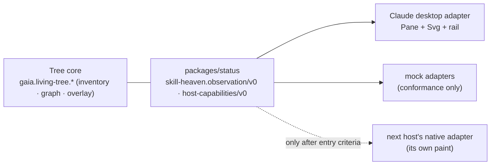

# C cockpit opportunities, the optional CLI Mod, and the host watch

**Nothing on this page starts before the B gate (G3).** It exists so ideas have a scored home instead of
becoming a feature cemetery of independent panes. Hub: [`README.md`](README.md).

## 1. How a C opportunity earns its place

Each candidate is scored 1–5 on five axes; higher is better on all of them (complexity and risk are
scored inversely).

| Axis | 5 means |
|---|---|
| **U** — utility | answers a question people actually ask while working |
| **O** — observable today | the data exists and is honest (verified or reported), not hoped for |
| **X** — low UX complexity | attaches to the tree's existing inspector, filters or overlay — no new pane |
| **R** — low risk | no new authority, privacy or supply-chain surface |
| **H** — host support | the Claude desktop primitives exist and are probed |

**Rule:** a C feature attaches to the tree (inspector, filter bar, overlay, rail section). A proposal
that needs its own pane needs a reason it cannot attach.

## 2. Candidates, ranked

| Rank | Candidate | U | O | X | R | H | Owner issue | What it is | Host test before building |
|---|---|---|---|---|---|---|---|---|---|
| 1 | **C1 Receipt and trust in the inspector** | 5 | 5 | 4 | 4 | 4 | #165 | the console's Session receipts and Trust facts open from any node or visitor; "what am I trusting" for the console itself | H5 (native controls), H17 (console paints on desktop) |
| 2 | **C3 Lens on the tree** | 4 | 5 | 3 | 4 | 4 | #163 | `/lens` previews draw faint "would summon" marks on the tree and in the band; Summon still only pre-fills the composer | H3 (faint marks), H10; never pre-authorizes (#85/#91) |
| 3 | **C2 Flow on the tree** | 4 | 4 | 3 | 5 | 3 | #164 | filter and colour-by agent; a compact agent rail (main → subagents, running/returned); the pane already follows the transcript being viewed | H10 (agent ids on desktop), Pane `view` switching |
| 4 | **C7 Native skill activity** (if not shipped as B5) | 4 | 2 | 4 | 4 | 2 | #164 / #2046 | halos for skills the host expanded itself | H11 |
| 5 | **C4 Scope as a lens on the tree** | 3 | 3 | 3 | 3 | 4 | #166 | "what is in scope" summarised against the tree; rung selection pre-fills; **loadouts remain do-not-build** until a core contract that cannot become a hidden authority boundary exists | none new; needs a core contract first |
| 6 | **C5 Session timeline** | 3 | 4 | 2 | 5 | 3 | #165 | scrub the session's live layer back and forth | H4 (redraw cost) |
| 7 | **C6 Skins** | 2 | 5 | 4 | 5 | 2 | #150 | cosmetic themes for the tree; never change meaning | H14 (no theme API today) |
| 8 | **C9 Deliberately keep a visitor** | 3 | 4 | 3 | 2 | 3 | #2046 / #193 | an explicit install of a summoned skill, with source, commit and consent | needs an install-consent design and Core/Full profile rules |
| 9 | **C10 Account directory and fleet inventory** | 3 | 1 | 3 | 2 | 1 | #2046 | tier-2 inventory with separate consent | unknown host route |
| 10 | **C8 Agent-proposed private edges** | 4 | — | 2 | 2 | 4 | #2046 | user-reviewed proposals for unmapped skills | **blocked** on FD-1 (c) and #1178 storage |

The founder approves the order after B ships; the scores are re-run with probe results in hand.

## 3. The optional CLI Mod (later, if worthwhile)

The Mods API draws on the terminal surface too, so a terminal panel is the *same* Mod drawing the
*same* snapshot and overlay — no second inventory, no second observer.

- **Shape:** summoned only by `/my-tree` in a terminal session; disappears completely when dismissed;
  coexists with the launcher and the one-line statusline; never opens unasked (the host only seats unasked
  panes from 144 columns anyway).
- **Paint:** the terminal table has `Raster`, `Image` and text cells but no `Svg` — a terminal-native
  design is its own design problem, not a shrunken desktop.
- **Entry criteria:** B shipped and refined on desktop; a terminal design that passes the ten-second test
  at 100×30; zero default-on; no multi-line HUD; no claim that it is a Mod fallback for a host without a
  desktop.

## 4. The host watch

### Entry criteria for offering B on any host — all required

1. a native pane or panel the person opens and dismisses;
2. rich graph paint that meets B-ACCEPTANCE Q1–Q12;
3. summon observation (materialized) and, where the host has it, body-read observation;
4. session lifecycle events;
5. a local-code safety model at least as strong as the host it replaces;
6. a pinned-version live probe passing the B scenarios on that host;
7. an adapter that maps into `skill-heaven.observation/v0` and the `gaia.living-tree.*` schemas with no
   core change (or a versioned one).

A host that meets 3 and 4 but not 1 or 2 stays **Core + receipts** — honestly labelled, never "Full",
never a Mod.

### Status, 2026-10-09

| Host | What we know | B today | Next research step |
|---|---|---|---|
| **Claude Code desktop** | desktop primitives declared (static, 2.1.294); console live-verified in the terminal (2.1.294) | **candidate — P1-H decides** | P1-H |
| **DeepSeek Harness** | its Claude Code Mods bridge (doc tracks 2.1.287, read 2026-10-09) raises `ui.render` for the prompt band only, never places a `Pane` (`$.ui.open` answers not placed), never raises `skill.prompt`, says nothing of `Svg`, runs mods unsandboxed, and has no validate/test or hot reload; DeepSeek has its own native plugin system (Cordis, `cordis.yml`, `defineMod`) | **not via the bridge** (a bridge-to-a-bridge at well under B) | research packet R-DS below |
| **Codex** | plugins package skills and tools; summon works (0.161.0, live, #187); no Claude-style Mod UI established | Core + receipts | watch each release for a pane/panel and event API |
| **Pi** | extension API; `ctx.ui.setStatus` carries the canonical line (1.0.4, live); terminal UI | Core + CLI | check for a panel surface only if the CLI Mod is pursued |
| **Hermes** | plugin runtime; no public status contribution API (#185) | Core + receipts | watch |
| **Grok** | plugin install and inventory (1.0.46, static) | Core | live summon pin pending |
| **Antigravity (Agy)** | plugin compatible (1.3.1, live) | Core | status entry not built (#137) |
| **Cursor** | not installed locally; status replaces the native footer | Core research | — |

### Research packet R-DS — DeepSeek native route

For a Luna scout (exact doc reads, version pinned) and a Sol analysis. Output: matrix rows plus a verdict
of *B-capable*, *not yet*, or *unknown*.

1. Does a native DeepSeek plugin get a pane or panel in its desktop or web client, and what can it paint
   (SVG, canvas, HTML, cells)?
2. Which events can a native plugin observe — tool results, file reads, agent attribution, skill
   activation, session lifecycle?
3. What isolates plugin code, and how is a plugin installed, updated and removed?
4. Can it consume Agent Plugins v1 skill packages and MCP servers as Skill Heaven ships them?
5. Which version and date does each answer hold for?

### One contract, many adapters

New hosts add an adapter, a capability declaration and conformance runs. The core and the schemas move
only through versioned changes (CONTRACT §8).
