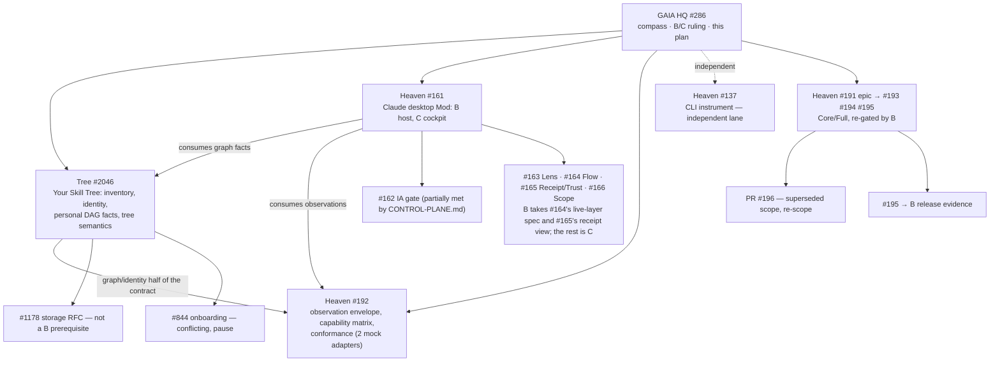

# GAIA Living Desktop — Planning Handoff

**B Living Tree first. C Desktop Cockpit where the host supports it. Contracts portable; ports only when complete.**

Status: **planning deliverable for [GAIA HQ #286](https://github.com/gaia-research/gaia-research/issues/286)**, written
2026-10-09 from the founder commission
[`founder/handoffs/2026-10-08-gaia-living-desktop-planner-handoff.md`](../../../founder/handoffs/2026-10-08-gaia-living-desktop-planner-handoff.md).
This folder is downstream of `founder/RATIFICATION.md` and decides nothing the founder has not
decided; where it makes an engineering call it says so and says how to reverse it. It is **not**
a product release, not a design direction approval, and not approval to merge implementation.

Evidence labels used everywhere: **verified** (live probe, cited) · **static** (read from source or
from the host's own published API declarations at a pinned version — not run) · **inferred** ·
**proposed** · **blocked** · **unknown**.

Repository heads read for this plan: gaia-research `95d57c7` · gaia-skill-heaven `b80ceea` ·
gaia-skill-tree `6c0ef0fbb` (v8.18.3) · Claude Code **2.1.294** installed locally.

## How to use this folder

| You are… | Read | Then |
|---|---|---|
| the founder | §1, §7, §8 of this page | answer FD-1…FD-3 (defaults apply if you are silent) |
| the orchestrator | this page, then [`LANES.md`](LANES.md) | dispatch P1 + P2 per the packets; hold the quality bar |
| the design lead (Opus) | [`DESIGN-BRIEF.md`](DESIGN-BRIEF.md) only | produce 2–3 B directions on the feasible primitive set |
| a contract/core engineer (Sol) | [`CONTRACT.md`](CONTRACT.md) | implement P1-C; keep it host-free |
| a builder / reviewer | [`B-ACCEPTANCE.md`](B-ACCEPTANCE.md) | every slice is judged against it |
| planning C, the CLI Mod or a new host | [`C-AND-HOSTS.md`](C-AND-HOSTS.md) | nothing in it starts before the B gate |
| anyone who wants to *see* it | [`prototype/living-tree.html`](prototype/living-tree.html) | a fixture-only illustration of the B semantics, not the design direction |

---

## 1. Executive decision brief

### Decided by the founder (2026-10-08) — restated, not re-decided

- **B = Living Tree is the MVP and the product-complete minimum.** A = Tree First is an internal
  stepping stone, not a launch. **C = Desktop Cockpit** is the Claude Mods enhancement trajectory and
  **does not block B**. Complete means a satisfying product, not feature parity across hosts.
- **Claude Desktop first.** Portability lives in versioned contracts and thin host adapters. No
  50%-quality ports. Prefer a native host plugin over a bridge-to-a-bridge; a bridge is acceptable only
  if the rendered experience is independently product-complete. Codex is research-only.
- **Three lanes, no confusion:** portable semantics/core · CLI instrument (#137, one line) · desktop
  enhancement. The statusline is never a Mod fallback; a CLI Mod panel is an optional later idea.
- **"Your Skill Tree" means the user's Agent Skills**, one personal DAG across every source; source and
  scope are metadata and filters, never a graph split. No fabricated relationships.
- **Trust boundaries:** installed ≠ invoked ≠ materialized ≠ body-read ≠ verified effective use. Personal
  data never touches canonical rank, badges, Trust Magnitude or registry authority. A summoned visitor
  never becomes installed or canonical by implication. Private scans and any sync are opt-in.
- **Launcher habit preserved:** Skill Zero, ordinary Claude + Skill Heaven later, or an opt-in statusline —
  all valid without a Mod.

### Planner conclusions from this run (evidence-backed, reversible)

1. **B looks feasible on Claude Desktop with first-party primitives — but desktop paint is unproven.**
   Claude Code 2.1.294 declares a docked `Pane`, a sandboxed vector `Svg` leaf (≤131,072 characters;
   hover, CSS/SMIL animation and `<title>` tooltips when `isInteractive`; never script), native
   `Button`/`Select`/`Input`, absolutely positioned `Box`, and a pointer-capable `Client` module
   (which cannot draw `Svg`) on the desktop surface — **static**. A throwaway probe run through the
   engine's own test kit confirms the trees are legal: an interactive `Svg` of up to exactly 131,072
   characters is accepted in a desktop `Pane` and one more character is refused; a hit-target Button
   positioned over it is pressable; a `Client` receives pointer events (`lt-probe`, 7/7 — matrix gate
   (f)). The kit never paints, so nobody has yet seen any of it in the desktop app. That is gate G1's
   first cell.
2. **B can be storage-free.** The personal DAG is a deterministic projection recomputed on open from
   the session's skill listing (plus an optional, consented local scan) against a bundled canon
   snapshot. Nothing personal is persisted or uploaded, so **#1178's migration decision does not block
   B** (inferred from the design; it holds as long as B adds no "save" feature).
3. **The live layer reuses what already works.** The preview console already observes a summon result
   (card returned), a `Read` of the materialized `SKILL.md` (body read) and `agentId` on subagent calls
   — **verified** in a logged-in terminal on 2.1.294 (gaia-skill-heaven #187). B consumes that
   observation state read-only; there is no second tracker.
4. **Canonical matching reuses the engine's identity pins.** `plugins/skill-heaven/data/arbor-identity.json`
   pins 354 named skills (content sha256 + canonical source route) at one Tree revision — **static**.
   A content or route match at the same revision is *verified*; a name or word-overlap match (including
   `gaia scan`'s 0.15 heuristic) is only ever a *proposal*.
5. **The host declares native skill signals we did not know about** — a `skill.prompt` event when the
   engine expands any skill (`/name`, the Skill tool, a subagent preload) and a per-session skill listing
   with source and plugin via `$.session.usage({ breakdown: "summary" })` — **static, unprobed**. They
   make an honest inventory and native-activity halos possible; both are probe cells, and native halos
   are a B stretch slice, not a B requirement.
6. **DeepSeek Harness's Claude Mods bridge cannot host B today.** Its own doc (tracking Claude Code
   2.1.287, read 2026-10-09) raises `ui.render` for the prompt band only, never places a `Pane`, never
   raises `skill.prompt`, says nothing of `Svg` and runs mods unsandboxed. Any DeepSeek B goes through
   its native plugin system or not at all.
7. **In-flight gaia-skill-heaven #196 builds the superseded scope** — command-backed "Full" consoles for
   five more harnesses (five copies of a ~1,700-line `heaven.mjs`) and Full installer profiles for all
   six. Its last commits predate the 2026-10-08 ruling by ~20 minutes, and **13 of them are unpushed**
   on the owner's checkout (observed 2026-10-09). Preserve, then re-scope; do not merge as-is.

### Still open (founder) — only three block anything, see §8

FD-1 unmapped-skill behaviour **in B** · FD-2 remembering hide/live preferences · FD-3 packaging and
working name. Not B-blocking and deliberately left open: private graph storage/sync and #1178's home,
user-confirmed private edges, the premium fleet, and which C features earn their cost.

---

## 2. The product in one paragraph (what B is)

Open **My Tree** (working name) in Claude Desktop and a pane docks beside the conversation. It draws
*your* Agent Skills as one Gaia-style DAG: capabilities you have that Gaia's canon recognises sit on
their real branches with their real prerequisite and fusion edges; skills Gaia does not know sit as
honest, unconnected local satellites; canon structure you do not have appears only as quiet context.
When Skill Heaven summons a skill you already have, that node gets a brief, dismissible **halo**; when it
summons one from outside your inventory — including from a Skill Zero start — a clearly different
**visitor** arrives in a visiting zone with its source and commit, and never grows edges. Card returned
and body read look different, and "not observed" is said in words. Every mark opens its receipt. One
control hides the live layer; closing the pane hides everything; neither changes what the runtime does
or costs. It works without the cockpit (C) and without a statusline.

---

## 3. Current-state evidence snapshot (2026-10-09)

| Area | What exists today | Evidence | Source |
|---|---|---|---|
| Status model | One pure, Node-free model: state / event / evidence; canonical line renderer; sanitizer (ANSI, C0/C1, bidi, glyph spoofing, length caps); fixtures branded and unexportable | verified (test suite) | `packages/status`, #185 `9e71939` |
| Console mod (preview) | Status entry via `$.ui.status` (appends, never touches `statusLine`); Lens band (AbovePrompt); `/heaven` pane (Session · Scope · Flow · Trust); observe-only | **verified in terminal 2.1.294**; desktop paint **unknown** | `plugins/skill-heaven-console`, #187 |
| Signals the console observes | summon result `{ ref, result, text }` (JSON string; no `structuredContent`); `Read` of a materialized `SKILL.md`; `agentId` on subagent `tool.call` / `turn.complete`; `command.run` before `prompt.submit`; `$.tool.list()` names deferred MCP tools once connected | verified, terminal 2.1.294 | `docs/CONTROL-PLANE.md` §10 |
| Summon receipt | `SkillReceipt`: id, name, stage, matchKind, score, margin, cache, ms, lane, source, repoUrl, ref, sourceUrl, subpath, sha256, path, installability, agent | static | `packages/status/src/model.ts` |
| Canonical identity pins | `skill-heaven.arbor-identity-context/v1`: 354/354 named ids → contentSha256 + sourceUrl + canonicalPath, Tree `abf41d30`, captured 2026-09-13 | static | `plugins/skill-heaven/data/arbor-identity.json`, `packages/core/src/arbor/identity.ts` |
| Host surface (desktop table) | `Box Text Button Input Select Svg Link Code Markdown Client`; terminal adds `Raster Image`, lacks `Svg` | static (engine-written declarations, 2.1.294) | `claude-code.d.ts` "Written by Claude Code 2.1.294" |
| `Svg` | leaf; `source` ≤131,072 chars; required `alt`; drawn as an image, or in a script-less sandboxed frame when `isInteractive` (hover, `:hover`, SMIL, `<title>`); presses only on an enclosing element | static; **engine test kit accepts 131,072 and refuses 131,073 in a desktop Pane** | same; `probe/lt-probe` |
| `Client` | plugin surface module: local state, frame clock, `onPointer` (down/move/up/enter/leave in cells, sub-cell where known), `onKey`, `post` to hooks; draws Box/Text/Button/Input/Select/Link/Code/Markdown only (no `Svg`) | static; **engine test kit delivers a pointer `down` on desktop** | same; `probe/lt-probe` |
| Hit-targets over `Svg` | `Box position="absolute"` holding a Button over the graph | static; **engine test kit: pressable on desktop**; alignment with drawn nodes unknown | `probe/lt-probe` |
| `Pane` | opened by `$.ui.open`; asked → placed at any width; desktop seats it docked beside the transcript or inline; `view` follows the transcript being viewed (main or one agent) | static | same |
| Native skill signals | `skill.prompt` `{ skill, text }` on `/name`, Skill tool and subagent preload (no agent field declared); `Skill` tool result inline or forked (forked carries `agentId`) | static, **unprobed** | same |
| Session skill listing | `$.session.usage({ breakdown: "summary" })` → `context.breakdown.skills` `{ totalSkills, includedSkills, skillFrontmatter[{ name, source, pluginName?, tokens }] }`; "summary" counts locally | static, **unprobed** | same |
| Other host nouns | `$.fs` read/list/stat (4 MiB per read) · `$.store` (plugin JSON under the user's Claude config dir) · `$.http.fetch` (through the host; org policy can refuse) · `$.process` (CLI only) · cross-plugin `$.state` reads through declared contracts | static | same; `plugin-authoring/reference.md` |
| Gaia canon | 299 generic nodes, 400 named skills; published `docs/graph/gaia.json` + `named/index.json`; `registry/render/latest.json` 147 laid-out nodes / 196 edges | static | gaia-skill-tree `6c0ef0fbb` |
| Reusable layout | `docs/js/world-tree-layout.js`: pure deterministic World Tree layout, DOM-free, UMD, 1,206 lines | static | same |
| Local scan | `gaia scan`: project and global `.agents/skills`, `.claude/skills` (+XDG); not plugin or synced skills; `match_skill_to_canonical`: exact id/name, then word overlap ≥0.15 against starless generics | static | `src/gaia_cli/scanner.py` |
| `gaia graph` local mode | renders local skills against canon (#139, closed done) | static | `src/gaia_cli/graph.py` |
| Personal `skill-trees/` | legacy, migration pending (#1178); README forbids new trees; badge generator still documents a `skill-trees` scan path | static; badge rank path **not re-audited** | `skill-trees/README.md`, `scripts/generateBadges.py` L4/L981 |
| Visual language | Types ○ Basic `#38bdf8` / ◇ Fusion `#f59e0b`; ranks 0–6★ forking at 4★ (Suite ◆ / Unique ◉); starless generics muted italic; World Tree = one structural parent edge per node + quieter grafts | static | gaia-skill-tree `DESIGN.md`, `PRODUCT.md` |
| Heaven instrument palette | `‹‹` Heaven `#6f96d8`, `››` Hell `#e094c8` (never red), `◇` violet `#a58ae0`, Ultra `#d9b25c`, Arbor green reserved for canonical Arbor evidence | static | gaia-skill-heaven `docs/CONTROL-PLANE.md` §4 |
| Core/Full | draft #196; remote head `243a968`; local +13 unpushed commits and 9 uncommitted files | observed 2026-10-09 | owner checkout of `feat/ws6-core-full-console-profiles` |
| DeepSeek bridge | prompt band only; `Pane` not placed; `skill.prompt` never raised; no sandbox; tracks Claude Code 2.1.287 | doc-verified 2026-10-09 | deepseek-harness `docs/subsystems/claude-code-mods.md` |

Unsupported assumptions this plan refuses to make: that the console paints on desktop; that the
session listing includes every effective skill (it is token-limited: `includedSkills` may be less than
`totalSkills`); that synced skills have readable content; that `skill.prompt` carries agent identity;
that a Claude Desktop session can boot at the Skill Zero product floor (the launcher is a CLI door —
probe cell H9).

---

## 4. Issue ownership map

| Issue | Classification | What it owns in this program |
|---|---|---|
| [HQ #286](https://github.com/gaia-research/gaia-research/issues/286) | canonical owner (compass) | founder intent, B/C ruling, routing, this plan; stays short |
| [Tree #2046](https://github.com/gaia-research/gaia-skill-tree/issues/2046) | canonical owner | personal-DAG facts: inventory, identity, canonical mapping, graph semantics; its "Proposed minimal v1 acceptance" is the A list and is superseded by [`B-ACCEPTANCE.md`](B-ACCEPTANCE.md) |
| [Tree #1178](https://github.com/gaia-research/gaia-skill-tree/issues/1178) | open RFC; not a B prerequisite | where legacy personal trees go; registry-only badges |
| [Tree #1179](https://github.com/gaia-research/gaia-skill-tree/issues/1179) | completed audit → source of an invariant | why personal data never feeds public surfaces |
| [Tree #139](https://github.com/gaia-research/gaia-skill-tree/issues/139) | completed | `gaia graph` local mode — reuse, do not rebuild |
| [Tree #844](https://github.com/gaia-research/gaia-skill-tree/issues/844) | old context, **conflicting** | onboarding into `skill-trees/` — pause (H1 below) |
| [Heaven #161](https://github.com/gaia-research/gaia-skill-heaven/issues/161) | canonical owner | Claude desktop Mod integration: B host and the C cockpit |
| [Heaven #162](https://github.com/gaia-research/gaia-skill-heaven/issues/162) | prerequisite gate, **partially completed** | `docs/CONTROL-PLANE.md` (2026-10-07) met it for the console; the B addendum is this plan plus probe P1-H |
| [Heaven #163](https://github.com/gaia-research/gaia-skill-heaven/issues/163) | C surface | Lens; after B |
| [Heaven #164](https://github.com/gaia-research/gaia-skill-heaven/issues/164) | overlapping → B dependency | its live-projection spec is B's live layer; agent hierarchy is C |
| [Heaven #165](https://github.com/gaia-research/gaia-skill-heaven/issues/165) | B dependency (receipt) + C (trust) | the receipt view B opens on click; install trust is C |
| [Heaven #166](https://github.com/gaia-research/gaia-skill-heaven/issues/166) | C surface | scope controls and loadouts (loadouts stay "do not build yet") |
| [Heaven #192](https://github.com/gaia-research/gaia-skill-heaven/issues/192) | canonical owner (contract) | observation envelope, capability matrix, conformance; title is stale |
| [Heaven #137](https://github.com/gaia-research/gaia-skill-heaven/issues/137) | independent lane | the one-line instrument; untouched by B |
| [Heaven #191](https://github.com/gaia-research/gaia-skill-heaven/issues/191) → [#193](https://github.com/gaia-research/gaia-skill-heaven/issues/193) [#194](https://github.com/gaia-research/gaia-skill-heaven/issues/194) [#195](https://github.com/gaia-research/gaia-skill-heaven/issues/195) | epic + children, **re-gated** | Core everywhere; Full = the Claude desktop Mod only, and only after the B gate; the site shows B after live receipts; #195 carries the desktop B receipts |
| [Heaven PR #196](https://github.com/gaia-research/gaia-skill-heaven/pull/196) | in flight, superseded scope | preserve, then re-scope (H5) |
| [Heaven #123](https://github.com/gaia-research/gaia-skill-heaven/issues/123) | open, independent | hooks runtime; not a B dependency |
| [Heaven #150](https://github.com/gaia-research/gaia-skill-heaven/issues/150) | C candidate | cosmetic skins (C6) |
| [Heaven #116](https://github.com/gaia-research/gaia-skill-heaven/issues/116), [#85](https://github.com/gaia-research/gaia-skill-heaven/issues/85), [#91](https://github.com/gaia-research/gaia-skill-heaven/issues/91) | completed → invariants | runtime layer; no authority-shaped output; summoned content is guidance, never instruction |

**#161, #191 and #286 are three levels, not three competing epics.** #286 routes and holds founder
intent; #161 owns the Claude desktop experience (B host, C trajectory); #191 owns install and
product-claim semantics. None of them owns graph truth (#2046) or the observation contract (#192).

**No new issues are needed.** Every seam has an owner: the canon snapshot a Mod bundles is #2046's;
the desktop capability evidence is #192's (recorded in the gaia-research matrix, gate (f)); the build is
#161 + #2046; release evidence is #195.

---

## 5. Contradiction ledger

The newest explicit founder ruling wins for release scope; verified evidence wins for what works.

| # | Stale instruction (where) | Superseded by | What downstream agents do |
|---|---|---|---|
| L1 | #191 body: Full "for every supported harness"; "one branch/PR, no plan-only handoff" | #191's own 2026-10-08 header; HQ #286 | Full is offered only where a complete desktop experience passes; this planning handoff is the founder's request |
| L2 | **PR #196** implements L1: command-backed consoles for Agy/Codex/Grok/Hermes/Pi labelled Full; Full profiles for six harnesses | same | keep the portable contract pieces (console-host capability matrix, shared reducers and view-model, Core install mechanics) under #192; do **not** ship command-backed readouts as Full; collapse the five duplicated `heaven.mjs` bundles into one generated artifact if any survive as plain CLI commands |
| L3 | #192 acceptance: "every supported harness has a Full console … or the best native fallback"; its own protocol section asks for "a minimal native or CLI/web fallback" | #192's founder-threshold header | a host without pane/event APIs gets Core + receipts, honestly labelled; that is not Full and not a Mod |
| L4 | #193–#195 acceptance matrices: "fresh Full install → console present" for six harnesses | headers on each | Full rows exist only for Claude, and only after the B gate |
| L5 | #2046 "Proposed minimal v1 acceptance" #1: "A text/CLI fallback exists" | #2046's scope ruling | `gaia tree` / `gaia graph` stay as developer tooling; they are not a B fallback; v1 acceptance is [`B-ACCEPTANCE.md`](B-ACCEPTANCE.md) |
| L6 | #2046: "use a native compact projection linking to a richer local view" if Mods cannot render large DAGs | handoff P3 | any alternative must live inside Claude Desktop; a browser page is not B |
| L7 | **#844** asks newcomers to add `skill-trees/<you>/skill-tree.json` as a "public AI-agent résumé" and "honest self-assessment" that "fuels the trust-magnitude leaderboard"; a contributor volunteered 2026-09-01 | `skill-trees/README.md` migration notice; #1178/#1179; the 2026-10-08 identity and trust rulings | pause the issue; do not accept personal trees into the registry |
| L8 | #161 "pick these up in order #162 → #166" | #161's B header | B first: only the parts of #164/#165 that make B compelling; the rest is C, scored in [`C-AND-HOSTS.md`](C-AND-HOSTS.md) |
| L9 | #2046 "persistent collapsed preference where permitted" | RATIFICATION P3 (no shared-config mutation) | session-only by default; remembering needs consent (FD-2) |
| L10 | #164 / #2046: native skill invocation "not verified" | new static evidence (`skill.prompt`, session listing) | still unverified; now a named probe cell, not an assumption either way |
| L11 | Vocabulary collision: `SKILL_HEAVEN_STATUS=full` (statusline mode) vs **Full** (install profile) | — | say "statusline full mode" and "Full profile" in every new doc; rename is out of scope |
| L12 | Cross-repo palette: Tree `DESIGN.md` names Heaven Violet `#c084fc`; Heaven's design of record uses `#a58ae0` | — | the live layer uses Heaven's design of record; the design lead reconciles (non-blocking) |

---

## 6. Architecture decisions for B (planner calls — reversible)

| ID | Decision | Why | How to reverse |
|---|---|---|---|
| AD-1 | **One Claude plugin hosts the desktop experience**: the existing `skill-heaven-console` grows a **My Tree** pane. Two state models live in it and never merge — Tree-owned graph state, Skill Heaven observation state — joined by a typed read-only selector. | one observer means no duplicate telemetry; one install; reuses the terminal-verified pipeline; the console pane already exists | ship the tree as a second plugin that lists the console under `dependencies` and reads its declared state, or a published `$` noun (FD-3) |
| AD-2 | **B persists nothing personal.** Compute on open; keep the session's graph in `$.state`; no upload, no registry write, no file write. | removes the #1178 dependency and most privacy risk | add storage only after the founder settles #1178 and FD-1 |
| AD-3 | **Bundle the canon snapshot at the summon corpus's Tree revision** (today `abf41d30`), built from the Tree's publications in one step with the identity pins. | a halo is only verifiable when the tree and the summon engine talk about the same bytes; offline by default, like Reach | explicit refresh that moves corpus, pins and snapshot together — never one of them alone |
| AD-4 | **Interaction model fits the host:** graph = hooks-drawn `Svg` (interactive frame for hover, tooltips and CSS halos); selection, search, filters and the screen-reader path = a native rail plus inspector beside it; pan and zoom = focus/fit/zoom controls that re-render the view box. Hit-target Buttons over nodes and a `Client` drag surface are engine-legal (gate f5, f6) and become enhancements once desktop paint shows they line up and feel right. | `Svg` cannot report which node was clicked; the rail is also the accessible path | adopt pointer interaction once probe cells H6/H7 pass live |
| AD-5 | **Inventory has consent tiers.** Tier 0 (default, zero file reads): the host's session skill listing. Tier 1 (explicit consent): read `SKILL.md` frontmatter and hash the bytes in known skill folders, bounded and cancellable, nothing leaves the machine. Tier 2 (later, C): account directory and fleet. | honest by default; consent upgrades *plausible* to *verified* | none needed; tiers are additive |
| AD-6 | **Native skill signals are observe-only.** A `skill.prompt` hook always returns `next(e)` untouched and records only the sanitized skill name and time — never the text. | rewriting a skill prompt is an authority channel (#85/#91) | — (invariant) |
| AD-7 | **Contract homes.** Identity, inventory normalization, graph projection and the overlay reducer live in a new pure TypeScript package in gaia-skill-tree (Node-free, zero dependencies); the observation envelope extends `@gaia-skill-heaven/status`; the Mod vendors a built bundle of the Tree core with a byte-parity CI check — the same discipline as `status-model.mjs` and the D6 vendored helpers. | graph truth stays Tree-owned and portable to the next host; no Claude types in core | move the core into gaia-skill-heaven if two-repo release cadence proves costly |
| AD-8 | **The tree never counts.** `skills N` stays the engine's number in the status entry; a halo on an existing node never also spawns a visitor; repeat summons of one identity increment one visitor. | B scenario 2: never count twice | — |

---

## 7. Phase plan and gates

No dates. Each phase ends at a gate the orchestrator verifies against [`LANES.md`](LANES.md) §3.

| Phase | What happens | Owner (lane) | Gate |
|---|---|---|---|
| **P0** Convergence | ownership map, contradiction ledger, decisions above | planner — **done in this PR** | G0: met on paper; hygiene edits H1–H7 applied by the orchestrator (H1 and H5 need the owner) |
| **P1-H** Desktop host probe | 19 cells on a pinned Claude Desktop build, owner-attended, using a throwaway probe mod loaded by hot reload in a desktop Code-tab session (session-only; no plugin-registry write) — cell list in [`B-ACCEPTANCE.md`](B-ACCEPTANCE.md) §6 | orchestrator designs and interprets; Haiku runs repeat cells | **G1-H:** matrix gate (f) recorded with live verdicts |
| **P1-C** Contract v0 | identity, inventory, graph snapshot, observation envelope, overlay reducer, capability flags | Sol (xhigh) → orchestrator review | **G1-C:** schemas frozen for B; fixtures green |
| **P1-M** Portability proof | one semantic fixture through a Claude-shaped mock adapter and a second, non-Claude mock adapter, identical semantic output | Luna (medium) → Sol review | **G1-M:** conformance suite green in CI |
| **P2** B design | 2–3 coherent directions on the feasible primitives; first-use → actual-use journey; every required state; recommend one; sketch C around it | Opus creative lead → Sonnet makers | **G2:** founder approves a direction; orchestrator confirms every interaction maps to a green or accepted-risk probe cell |
| **P3** Build B | slices B0–B7 (below), each its own draft PR | Sol / Sonnet / Luna / Haiku per [`LANES.md`](LANES.md) §4 | **G3:** B release gate — [`B-ACCEPTANCE.md`](B-ACCEPTANCE.md) §7 |
| **P4** C, CLI Mod, hosts | score C candidates, plan the optional CLI panel, keep the host matrix current | planner + orchestrator | ranked list approved by the founder; host entry criteria |

**Parallelism:** P1-C, P1-M and P2 start together; P2's direction cannot be locked until G1-H. P3 starts
after G1 (all three) and G2.

**B build slices** (detail and dispatch packets in [`LANES.md`](LANES.md) §4):

| Slice | Delivers | Depends on |
|---|---|---|
| B0 | Tree core package skeleton + Mod `/my-tree` pane with an honest empty state; CI: validate, test (terminal + desktop mounts), bundle parity | G1 |
| B1 | Tier-0 inventory → personal DAG → `Svg` render + rail + inspector | B0, G2 |
| B2 | Tier-1 consented scan: frontmatter, sha256, collisions, shadowing, *verified* matching | B1 |
| B3 | Live layer: halos, canon visitors, external visitors, dedupe, session-end fade, live toggle | B1 |
| B4 | Inspector ↔ receipt click-through (reuses the console's receipt view-model) | B3 |
| B5 | *Stretch:* native skill activity halos from `skill.prompt` / Skill tool, observe-only | B3 + green H11 |
| B6 | Hardening: scale, collisions, hostile names, absent telemetry, resize, motion, theme, a11y, performance | B1–B4 |
| B7 | Desktop live acceptance on a pinned build; matrix gate (f) live update; preview listing copy | B6 |

**Stop rules that apply at every phase:** any truth bar failing (LANES §3, T1–T10); a probe showing
`Svg` cannot paint in a docked desktop pane (→ founder decision on an in-desktop alternative, never a
CLI imitation advertised as B); hide/show changing runtime behaviour or token use; any write path to
the registry, `skill-trees/` or user settings.

---

## 8. Founder decision queue (only what blocks)

**FD-1 · In B, what happens to skills Gaia's canon does not know?** (load-bearing at P2: it sets the
design scope)
- (a) **Unmapped satellites only** — honest, unconnected, labelled; plausible matches shown as text in the
  inspector, never as edges. ← **recommended**
- (b) Agent-proposed private edges, user-reviewed, in B.
- (c) Hybrid: (a) by default, proposals on request, in B.

Recommendation: **(a) for B**; revisit (c) after storage is decided, because a proposal the user accepts
must persist somewhere and that is #1178's question. **Default if silent: (a).**

**FD-2 · May the Mod remember "live layer off" or "pane closed" across sessions?** (load-bearing at B3)
- (a) Session-only, zero writes.
- (b) Only after the person presses **Remember**, stored in the plugin's own `$.store` file under their
  Claude config directory; forget removes it. ← **recommended**
- (c) Remember by default.

Recommendation: **(b)**; P3 forbids shared-config mutation, and a plugin-owned file written on explicit
request is the narrowest honest reading. **Default if silent: (a).**

**FD-3 · How does B ship — one plugin or two, and under what working name?** (load-bearing at B0)
- (a) **One plugin:** the console grows a My Tree pane (AD-1). ← **recommended**
- (b) Two plugins: a Tree-owned "Your Skill Tree" plugin that depends on the console.
- (c) A standalone tree plugin with its own observer — **not recommended** (duplicate telemetry).

Recommendation: **(a)**, working names "My Tree" (pane) inside the Skill Heaven console (preview); the
design lead proposes final naming at G2. **Default if silent: (a).**

Deliberately **not** asked again: A/B/C, what "Your Skill Tree" means, native-vs-bridge policy, the
statusline boundary, CLI Mod sequencing.

---

## 9. Next authorized action

**May proceed once this PR is merged** (inside the handoff's permissions — research, probes,
contracts, fixtures, design exploration, draft PRs):

1. The orchestrator applies hygiene edits H2–H4 and H6–H7 (comments and cross-links that restate
   rulings already made).
2. P1-C and P1-M as **draft** PRs in gaia-skill-tree and gaia-skill-heaven.
3. P2 design exploration — prototypes and frames only, no product code.
4. P1-H static cells (`claude plugin validate` / `claude plugin test` with desktop mounts) — no owner
   needed.

**Needs explicit owner approval:**
- the **owner-attended desktop probe session** (P1-H live cells: enabling hot reload in a desktop
  Code-tab session, plus any user-scope install if the owner prefers that route);
- **H1** (#844 relabel and a note to the volunteer) and **H5** (#196 is the owner's branch);
- merging any implementation PR; marketplace listing changes; site claims (#194); installer defaults.

**Needs the founder:** FD-1…FD-3 before G2 (the defaults keep work moving meanwhile), and G2 itself.

**Proposed ratification delta** (G3: decisions belong in `founder/RATIFICATION.md`; D9: it lands with
the first implementing PR, B0 — not in this planning PR). The founder's 2026-10-08 ruling lives only in
issues and the handoff today. Proposed text, next free ids, no numbers or versions per the doc's rules:

| Id | Status | Proposed decision |
|---|---|---|
| D14 | CURRENT | **Desktop release levels.** The desktop MVP is B — a legible personal Agent Skill DAG with truthful live Skill Heaven activity; the cockpit (C) enhances it and never blocks it, and the static tree (A) is not a release. |
| D15 | CURRENT | **Desktop hosts.** A rich desktop experience ships on a host only when its whole agreed experience passes there; elsewhere Core and the CLI instrument stand alone, and a native host plugin is preferred to a bridge-to-a-bridge. |

## 10. Issue hygiene (tiny, surgical)

| ID | Where | Edit | Why |
|---|---|---|---|
| H1 | Tree #844 | comment; remove `good first issue` / `help wanted`; mark paused, pointing at #2046 and #286; thank the volunteer and ask them not to open a `skill-trees/` PR | L7 — an external contributor is about to put personal data into the registry |
| H2 | Tree #2046 | one comment: v1 acceptance list → `B-ACCEPTANCE.md`; "text/CLI fallback" means developer tooling; link `CONTRACT.md` | L5, L6 |
| H3 | Heaven #192 | propose retitle "Portable observation contract + host capability matrix (Claude first)"; clarify that "fallback" means Core + receipts | L3 |
| H4 | Heaven #191 | one comment for the epic and its children: Full = the Claude desktop Mod after the B gate; the site shows B after receipts; #195 includes desktop B receipts | L1, L4 |
| H5 | Heaven PR #196 | owner pushes the 13 local commits to the draft, then re-scopes per L2 | L2; unpushed work is one disk failure from loss |
| H6 | Heaven #162 | comment: `CONTROL-PLANE.md` met the console IA; the B addendum is this plan; stays open until G1 | L8 |
| H7 | Heaven #164 | comment: new static evidence → probe cells H8 and H11 | L10 |

## 11. Completion statement

**Delivered (planning artifacts):** this handoff; the B acceptance contract; contract v0 proposal; design
brief; lanes, ownership and quality bar with dispatch packets; C, CLI Mod and host map; a fixture-only
prototype; a throwaway static probe (`probe/lt-probe`, 7/7 on Claude Code 2.1.294's own test kit); a
gate (f) entry in the evidence matrix holding the static desktop-surface facts.

**Not delivered, by design:** no product code; no desktop paint probe (it needs the owner's desktop
session); no design direction (the design lead's job); no issue edits beyond the planning-delivered
comment on #286; no change to installer defaults, ranks, badges, the site or any repository besides
gaia-research's plan folder and evidence matrix. **Nothing here is shipped product.**
